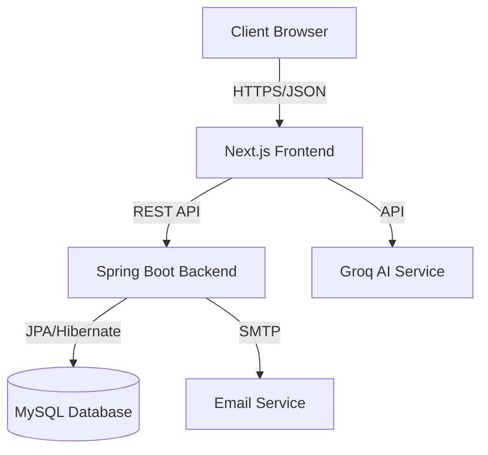

# 🎓 Student Dormitory Management System

<div align="center">


**A modern, full-stack solution for university dormitory operations, featuring role-based access control, real-time occupancy tracking, and AI-powered assistance.**

[View Demo](#-screenshots) • [Report Bug](https://github.com/raruhan6-ops/Student-Dormitory-Management-System-Java/issues) • [Request Feature](https://github.com/raruhan6-ops/Student-Dormitory-Management-System-Java/issues)

</div>

---

## 📋 Table of Contents

- [Project Overview](#-project-overview)
- [Key Features](#-key-features)
- [System Architecture](#-system-architecture)
- [Tech Stack](#-tech-stack)
- [Database Design](#-database-design)
- [API Documentation](#-api-documentation)
- [Getting Started](#-getting-started)
- [Bonus Features](#-bonus-features)
- [Default Accounts](#-default-accounts)
- [Screenshots](#-screenshots)

---

## 📖 Project Overview

The **Student Dormitory Management System** is an enterprise-grade web application designed to digitize and streamline the complex operations of university housing. It replaces manual, paper-based processes with a centralized digital platform, ensuring data accuracy, operational efficiency, and a better experience for students and staff.

### Core Objectives
- **Digital Transformation:** Move from spreadsheets to a relational database system.
- **Process Automation:** Automate check-in/out, room allocation, and repair workflows.
- **Data Integrity:** Enforce business rules through database constraints and triggers.
- **User Experience:** Provide a responsive, accessible interface for all user roles.

---

## ✨ Key Features

### 👨‍🎓 Student Portal
- **Dashboard:** View personal details, room assignment, and announcements.
- **Room Application:** Browse available rooms and submit accommodation requests.
- **Repair Requests:** Submit maintenance tickets with descriptions and track their status.
- **Profile Management:** Update contact info and export student records as PDF.
- **AI Assistant:** Chat with an integrated AI bot for system guidance and FAQs.

### 👨‍💼 Manager Portal
- **Occupancy Management:** Visual heatmap of buildings/rooms; real-time bed availability.
- **Check-In/Out:** Streamlined workflows for assigning beds and processing departures.
- **Maintenance Hub:** View, assign, and update status of repair requests.
- **Student Records:** CRUD operations for student data; bulk import/export via CSV.
- **Analytics:** View occupancy rates, repair trends, and building statistics.

### 👨‍💻 Admin Console
- **User Management:** Create/suspend accounts, reset passwords, and manage roles.
- **System Audit:** View detailed logs of all system activities (who did what, when).
- **Configuration:** Manage global system settings and master data.

---

## 🏗 System Architecture

The system follows a modern **Browser-Server (B/S)** architecture with a clear separation of concerns:



- **Frontend:** Next.js (App Router) for server-side rendering and static generation.
- **Backend:** Spring Boot REST API for business logic and data processing.
- **Database:** MySQL 8.0 for persistent storage with complex relationships.

---

## 🛠 Tech Stack

### Backend
| Component | Technology | Version | Purpose |
|-----------|------------|---------|---------|
| **Language** | Java | 21 | Core logic |
| **Framework** | Spring Boot | 3.4.0 | Application framework |
| **ORM** | Spring Data JPA | - | Database abstraction |
| **Database** | MySQL | 8.0 | Primary data store |
| **Security** | Spring Security | - | JWT Authentication |
| **Docs** | Apache POI | 5.2.5 | Excel Import/Export |
| **PDF** | OpenPDF | 1.3.35 | PDF Generation |

### Frontend
| Component | Technology | Version | Purpose |
|-----------|------------|---------|---------|
| **Framework** | Next.js | 14.2.10 | React Framework |
| **UI Library** | React | 18.2 | Component library |
| **Styling** | Tailwind CSS | 3.4 | Utility-first CSS |
| **Icons** | Lucide React | - | Iconography |
| **Charts** | Recharts | 3.5 | Data Visualization |
| **Search** | Fuse.js | 7.0 | Fuzzy Search |

---

## 🗄 Database Design

The database is normalized to 3NF to ensure data integrity. Below is the Entity-Relationship (ER) model:

```
┌─────────────────┐       ┌─────────────────┐       ┌─────────────────┐
│   DormBuilding  │       │      Room       │       │       Bed       │
├─────────────────┤       ├─────────────────┤       ├─────────────────┤
│ BuildingID (PK) │◄──────│ BuildingID (FK) │       │ BedID (PK)      │
│ BuildingName    │       │ RoomID (PK)     │◄──────│ RoomID (FK)     │
│ Location        │       │ RoomNumber      │       │ BedNumber       │
│ ManagerName     │       │ Capacity        │       │ Status          │
│                 │       │ CurrentOccupancy│       │ Version         │
└─────────────────┘       └─────────────────┘       └────────┬────────┘
                                                             │
┌─────────────────┐       ┌─────────────────┐       ┌────────▼────────┐
│  RepairRequest  │       │   UserAccount   │       │   CheckInOut    │
├─────────────────┤       ├─────────────────┤       ├─────────────────┤
│ RepairID (PK)   │       │ UserID (PK)     │       │ RecordID (PK)   │
│ RoomID (FK)     │       │ Username        │       │ StudentID (FK)  │
│ SubmitterID(FK) │       │ PasswordHash    │       │ BedID (FK)      │
│ Description     │       │ Role            │       │ CheckInDate     │
│ Status          │       │ RelatedStudentID│       │ CheckOutDate    │
└─────────────────┘       └─────────────────┘       └─────────────────┘
```

### Key Database Features
- **Triggers:** `trg_after_checkin` and `trg_after_checkout` automatically update bed status and room occupancy counts.
- **Views:** `vw_room_occupancy` provides a simplified interface for reporting.
- **Transactions:** Critical operations (Check-in, Room Change) are wrapped in ACID transactions.

---

## 📡 API Documentation

| Module | Method | Endpoint | Description |
|--------|--------|----------|-------------|
| **Auth** | POST | `/api/auth/login` | User login with captcha |
| | POST | `/api/auth/register` | New user registration |
| **Students** | GET | `/api/students` | List all students |
| | POST | `/api/students` | Create new student |
| **Dorm** | GET | `/api/dormitories` | List buildings & rooms |
| | POST | `/api/dormitories/check-in` | Assign student to bed |
| **Repairs** | POST | `/api/repairs` | Submit repair request |
| | PUT | `/api/repairs/{id}` | Update request status |
| **Stats** | GET | `/api/dashboard/stats` | Get system analytics |

---

## 🚀 Getting Started

### Prerequisites
- **Java JDK 21**
- **Node.js v18+**
- **MySQL Server 8.0**
- **Maven**

### Installation

#### 1. Database Setup
```bash
# Log in to MySQL
mysql -u root -p

# Create database and tables
source database/schema.sql

# Apply triggers and views
source database/bonus_features.sql
```

#### 2. Backend Setup
```bash
cd backend
# Edit src/main/resources/application.properties with your DB credentials
mvn spring-boot:run
```
*Server starts at `http://localhost:8080`*

#### 3. Frontend Setup
```bash
cd next-frontend
npm install
# Create .env.local if needed
npm run dev
```
*App starts at `http://localhost:3000`*

---

## 🎁 Bonus Features

This project implements several advanced features beyond the basic requirements:

- **🔐 Security:** CAPTCHA verification for login; BCrypt password hashing.
- **🤖 AI Integration:** Integrated Chatbot using Groq API for user assistance.
- **📊 Data Export:** Generate PDF reports for students; Import/Export CSV data.
- **⚡ Concurrency Control:** Optimistic locking (`@Version`) on Bed entities to prevent double-booking.
- **👁️ Visualizations:** Interactive heatmap for room occupancy status.

---

## 👤 Default Accounts

| Role | Username | Password | Access Level |
|------|----------|----------|--------------|
| **Admin** | `admin` | `admin123` | Full System Access |
| **Manager** | `manager` | `manager123` | Dorm Operations |
| **Student** | `20250001` | `student123` | Personal Portal |

---

## 📸 Screenshots

*(Add screenshots of Dashboard, Login Page, and Heatmap here)*

---

## 🤝 Contributing

Contributions are welcome! Please feel free to submit a Pull Request.

1. Fork the Project
2. Create your Feature Branch (`git checkout -b feature/AmazingFeature`)
3. Commit your Changes (`git commit -m 'Add some AmazingFeature'`)
4. Push to the Branch (`git push origin feature/AmazingFeature`)
5. Open a Pull Request

---

## 📄 License

Distributed under the MIT License. See `LICENSE` for more information.
