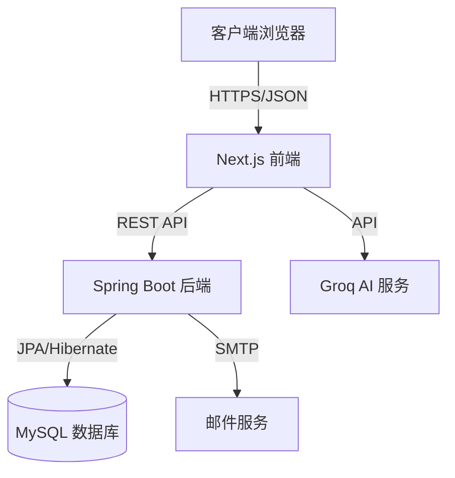

# 🎓 学生宿舍管理系统 (Student Dormitory Management System)

<div align="center">


**一个现代化的高校学生宿舍管理系统，支持多角色权限管理、智能房间分配、报修服务和数据分析。**

[查看演示](#-截图预览) • [报告Bug](https://github.com/raruhan6-ops/Student-Dormitory-Management-System-Java/issues) • [功能请求](https://github.com/raruhan6-ops/Student-Dormitory-Management-System-Java/issues)

</div>

---

## 📋 目录

- [项目简介](#-项目简介)
- [功能特点](#-功能特点)
- [系统架构](#-系统架构)
- [技术栈](#-技术栈)
- [数据库设计](#-数据库设计)
- [API文档](#-api-文档)
- [快速开始](#-快速开始)
- [Bonus功能](#-bonus-功能)
- [默认账户](#-默认账户)
- [截图预览](#-截图预览)

---

## 📖 项目简介

**学生宿舍管理系统** 是一个企业级的全栈Web应用，旨在数字化和简化高校宿舍管理的复杂流程。它用集中的数字平台取代了手工、纸质的流程，确保了数据的准确性、操作的效率，并为学生和教职工提供了更好的体验。

### 核心目标
- **数字化转型：** 从电子表格迁移到关系型数据库系统。
- **流程自动化：** 自动化入住/退房、房间分配和报修流程。
- **数据完整性：** 通过数据库约束和触发器强制执行业务规则。
- **用户体验：** 为所有用户角色提供响应式、无障碍的界面。

---

## ✨ 功能特点

### 👨‍🎓 学生端
- **仪表盘：** 查看个人信息、宿舍分配和公告。
- **房间申请：** 浏览可用房间并提交住宿申请。
- **报修请求：** 提交带有描述的维修工单并跟踪其状态。
- **个人资料管理：** 更新联系信息并将学生记录导出为PDF。
- **AI助手：** 与集成的AI机器人聊天，获取系统指导和常见问题解答。

### 👨‍💼 宿管端
- **入住率管理：** 楼栋/房间的可视化热力图；实时床位可用性。
- **入住/退房：** 简化的床位分配和退房处理流程。
- **维修中心：** 查看、分配和更新报修请求的状态。
- **学生记录：** 学生数据的增删改查；通过CSV批量导入/导出。
- **数据分析：** 查看入住率、维修趋势和楼栋统计数据。

### 👨‍💻 管理员端
- **用户管理：** 创建/暂停账户，重置密码和管理角色。
- **系统审计：** 查看所有系统活动的详细日志（谁在何时做了什么）。
- **系统配置：** 管理全局系统设置和主数据。

---

## 🏗 系统架构

本系统采用现代化的 **浏览器-服务器 (B/S)** 架构，关注点分离清晰：



- **前端：** Next.js (App Router) 用于服务端渲染和静态生成。
- **后端：** Spring Boot REST API 用于业务逻辑和数据处理。
- **数据库：** MySQL 8.0 用于具有复杂关系的持久化存储。

---

## 🛠 技术栈

### 后端 (Backend)
| 组件 | 技术 | 版本 | 用途 |
|-----------|------------|---------|---------|
| **语言** | Java | 21 | 核心逻辑 |
| **框架** | Spring Boot | 3.4.0 | 应用框架 |
| **ORM** | Spring Data JPA | - | 数据库抽象 |
| **数据库** | MySQL | 8.0 | 主数据存储 |
| **安全** | Spring Security | - | JWT 认证 |
| **文档** | Apache POI | 5.2.5 | Excel 导入/导出 |
| **PDF** | OpenPDF | 1.3.35 | PDF 生成 |

### 前端 (Frontend)
| 组件 | 技术 | 版本 | 用途 |
|-----------|------------|---------|---------|
| **框架** | Next.js | 14.2.10 | React 框架 |
| **UI 库** | React | 18.2 | 组件库 |
| **样式** | Tailwind CSS | 3.4 | 实用优先 CSS |
| **图标** | Lucide React | - | 图标集 |
| **图表** | Recharts | 3.5 | 数据可视化 |
| **搜索** | Fuse.js | 7.0 | 模糊搜索 |

---

## 🗄 数据库设计

数据库已规范化至 3NF 以确保数据完整性。以下是实体关系 (ER) 模型：

```
┌─────────────────┐       ┌─────────────────┐       ┌─────────────────┐
│   DormBuilding  │       │      Room       │       │       Bed       │
├─────────────────┤       ├─────────────────┤       ├─────────────────┤
│ BuildingID (PK) │◄──────│ BuildingID (FK) │       │ BedID (PK)      │
│ BuildingName    │       │ RoomID (PK)     │◄──────│ RoomID (FK)     │
│ Location        │       │ RoomNumber      │       │ BedNumber       │
│ ManagerName     │       │ Capacity        │       │ Status          │
│                 │       │ CurrentOccupancy│       │ Version         │
└─────────────────┘       └─────────────────┘       └────────┬────────┘
                                                             │
┌─────────────────┐       ┌─────────────────┐       ┌────────▼────────┐
│  RepairRequest  │       │   UserAccount   │       │   CheckInOut    │
├─────────────────┤       ├─────────────────┤       ├─────────────────┤
│ RepairID (PK)   │       │ UserID (PK)     │       │ RecordID (PK)   │
│ RoomID (FK)     │       │ Username        │       │ StudentID (FK)  │
│ SubmitterID(FK) │       │ PasswordHash    │       │ BedID (FK)      │
│ Description     │       │ Role            │       │ CheckInDate     │
│ Status          │       │ RelatedStudentID│       │ CheckOutDate    │
└─────────────────┘       └─────────────────┘       └─────────────────┘
```

### 关键数据库特性
- **触发器：** `trg_after_checkin` 和 `trg_after_checkout` 自动更新床位状态和房间入住人数。
- **视图：** `vw_room_occupancy` 为报表提供简化的接口。
- **事务：** 关键操作（入住、换房）均封装在 ACID 事务中。

---

## 📡 API 文档

| 模块 | 方法 | 端点 | 说明 |
|--------|--------|----------|-------------|
| **认证** | POST | `/api/auth/login` | 用户登录（含验证码） |
| | POST | `/api/auth/register` | 新用户注册 |
| **学生** | GET | `/api/students` | 获取所有学生列表 |
| | POST | `/api/students` | 创建新学生 |
| **宿舍** | GET | `/api/dormitories` | 获取楼栋和房间列表 |
| | POST | `/api/dormitories/check-in` | 分配学生床位 |
| **报修** | POST | `/api/repairs` | 提交报修请求 |
| | PUT | `/api/repairs/{id}` | 更新请求状态 |
| **统计** | GET | `/api/dashboard/stats` | 获取系统分析数据 |

---

## 🚀 快速开始

### 环境要求
- **Java JDK 21**
- **Node.js v18+**
- **MySQL Server 8.0**
- **Maven**

### 安装步骤

#### 1. 数据库设置
```bash
# 登录 MySQL
mysql -u root -p

# 创建数据库和表
source database/schema.sql

# 应用触发器和视图
source database/bonus_features.sql
```

#### 2. 后端设置
```bash
cd backend
# 修改 src/main/resources/application.properties 中的数据库凭据
mvn spring-boot:run
```
*服务器启动在 `http://localhost:8080`*

#### 3. 前端设置
```bash
cd next-frontend
npm install
# 如果需要，创建 .env.local
npm run dev
```
*应用启动在 `http://localhost:3000`*

---

## 🎁 Bonus 功能

本项目实现了超出基本要求的多个高级功能：

- **🔐 安全性：** 登录时的图形验证码验证；BCrypt 密码哈希。
- **🤖 AI 集成：** 使用 Groq API 集成的聊天机器人，用于用户协助。
- **📊 数据导出：** 生成学生 PDF 报告；导入/导出 CSV 数据。
- **⚡ 并发控制：** Bed 实体上的乐观锁 (`@Version`) 防止重复预订。
- **👁️ 可视化：** 房间入住状态的交互式热力图。

---

## 👤 默认账户

| 角色 | 用户名 | 密码 | 访问级别 |
|------|----------|----------|--------------|
| **管理员** | `admin` | `admin123` | 完整系统访问权限 |
| **宿管** | `manager` | `manager123` | 宿舍运营权限 |
| **学生** | `20250001` | `student123` | 个人门户访问 |

---

## 📸 截图预览

*(在此处添加仪表盘、登录页面和热力图的截图)*

---

## 🤝 贡献

欢迎贡献！请随时提交 Pull Request。

1. Fork 本项目
2. 创建您的特性分支 (`git checkout -b feature/AmazingFeature`)
3. 提交您的更改 (`git commit -m 'Add some AmazingFeature'`)
4. 推送到分支 (`git push origin feature/AmazingFeature`)
5. 开启一个 Pull Request

---

## 📄 许可证

本项目基于 MIT 许可证分发。详情请参阅 `LICENSE` 文件。
